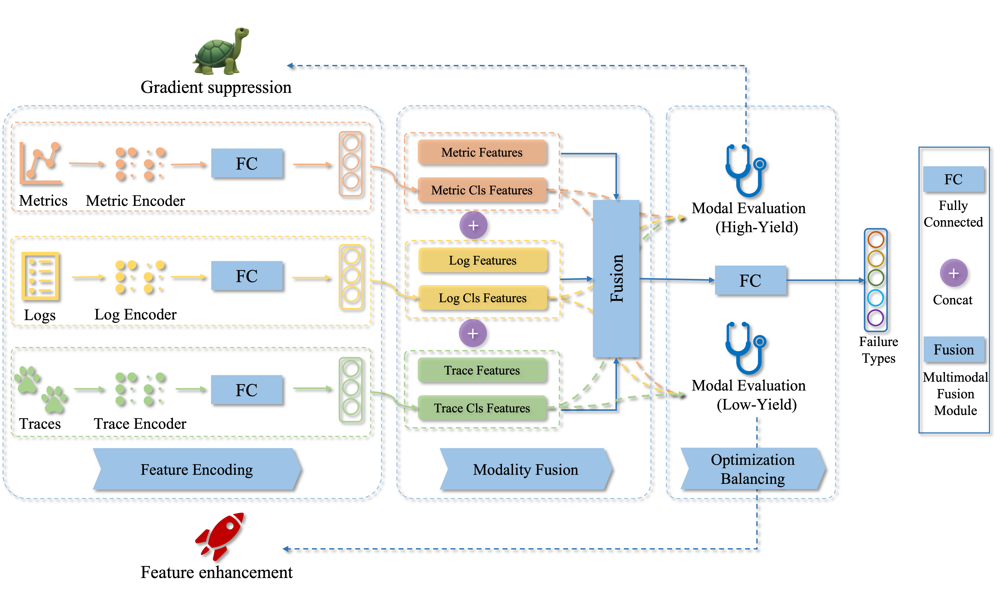

# Medicine

## Giving Every Modality a Voice in Microservice Failure Diagnosis via Multimodal Adaptive Optimization

The framework consists of three main stages: feature encoding, modality fusion, and optimization balancing. In the feature encoding stage, we design specific encoders for metrics, logs, and traces based on their characteristics. During the modality fusion stage, we use a fusion module with channel attention to combine the original statistical features and the failure classification features extracted by the encoders. In the optimization balancing stage, Medicine employs a modality evaluation component to identify high-yield and low-yield modalities, then uses a gradient suppression component to optimize high-yield modalities and a feature enhancement component to strengthen low-yield modalities.



## Description

### Folder Structure

#### Already Existing Folders
-   `./dataset`: it is used to preprocess and load data from specific path
-   `./models`: it stores models used in experiment
-   `./cache`: it stores the bert-base-uncased model used in experiment

#### Auto Generated Folders
-   `./data`: it stores the intermediary files of each preprocessed dataset
-   `./result`: it stores the result of each experiment


### File Description

-   `config.py`：the config file of D1(AIops22) and D2(GAIA)
-   `main.py`：the entry file of experiment
-   `trainer.py`：the script file of traun and test model
-   `utils.py`：the utils file

## Environment

-   Linux Server 20.04.1 LTS
-   Intel(R) Xeon(R) CPU E5-2650 v4@ 2.20GHz
-   Python version 3.9

## Getting Started

> Recommend conda environment or venv

Run the following commands in turn at bash or shell

1. `pip install -r requirements.txt`
2. `python main.py --dataset gaia` or `python main.py --dataset aiops22`

All result will be saved in `result/`

## Reproduce

1. download gaia and aiops22 dataset we provide for you
2. change dataset config in `./config.py` at the position described below:
    ```python
    gaia = {
        "dataset_dir": "path to downloaded gaia dataset entry"
    }
    aiops22 = {
        "dataset_dir": "path to downloaded aiops22 dataset entry"
    }
    ```
3. remove `./data` folder
4. run `python main.py --dataset gaia` or `python main.py --dataset aiops22`

All result will be saved in `result/`

## Some Issues

### 1. Have some trouble with downloading `bert-base-uncased` by using transformers

download pytorch version of `bert-base-uncased` from [huggingface](https://huggingface.co/google-bert/bert-base-uncased/tree/main)

then copy them into `./cache/`

# 只关注gaia相关的代码
跑的时候用这个命令：`python main.py --dataset gaia`
readme上面让装的依赖装一下，然后cache里面如果有bert的一堆东西就不用管，没有的话要在huggingface里下载，手动拉进来。
## 1. 关于运行逻辑
Medicine是一个先预处理数据后训练模型的框架，我们只用到Medicine的数据预处理部分，因此trainer.py中只关注MultiModalTrainer类中的__init__函数即可（我把train函数全部注释了），分别加载log、metric、trace，处理成特征向量。

我目前的方法是处理一个的时候，注释另外两个（这个也很丑陋，到时候可能要重新写个主函数来跑），代码会生成中间数据，就是特征向量。
## 2. 关于文件路径（参见config.py）
数据集存放路径是config.py中的dataset_dir；

生成的中间数据路径是config.py中的save_dir；

还有一个drain_save_path，是Medicine在处理Log时得到的中间drain.bin文件，这玩意儿不是特征向量；
## 3. 关于特征向量处理的逻辑
三种模态数据变成特征向量的处理逻辑分别在dataset/log.py、metric.py和trace.py中；
这里有一个比较抽象的点，在于metric划分服务是在代码中就实现的，跑metric时可以直接读整个最大的数据集，这个就是完整的newgaia数据集，形式是：
newgaia
	2021-07-04
	2021-07-05

但是log、trace的划分服务不是在代码中，现在是在数据集中，所以要处理log，数据集的形式如下，这种形式的数据集我写脚本切分处理过了，要的话直接找我
service
	dbservice1
		2021-07-04
		2021-07-05
	dbservice2
		2021-07-04
		2021-07-05

然后dataset_dir又要求目录下边必须直接是各个日期的文件夹，所以要想分服务跑log、trace的特征向量就必须一个服务改一遍dataset_dir、save_dir和drain_save_path，我目前用一种比较丑陋的方法，写了一个runbyservice脚本，自动改config里面的dataset_dir、save_dir以及drain_save_path（比如改成dbservice1的路径），然后脚本自动命令行启动。之后要发这个代码肯定得改。
### Metric
metric的处理过程应该不用动，简单说一下

303行的GaiaMetric类是加载gaia数据集的，执行的是最下面的load函数，上面两个函数是被调用的。

可以看到是按日期读入metric和groundtruth的。都暂时存在自己的df里；

每一天的数据都有一个groundtruth.csv，这个是注入记录，有注入的时间和根因；

然后看MetricDataset类__load_metric__函数，根据一条注入记录，去找这个时间内的metric，丢到meta_load_metric里去生成特征向量（不太确定，还得看看normalize_and_diff和rebuild函数是干什么的），拿回来的结果写到self.X中；
load_labels函数中，将根因的分类以及根因（哪个服务实例）写到self.y中；

metric最后生成的特征向量就是你的save_dir下面的gaia_metric_tmp.json，这个文件有两部分：data["X"]和data["y"]（注意大小写），如果没问题的话，data["X"]的维数应该是(1099, 10, 103)，代表1099个注入记录中，10个服务实例的183维特征向量；data["Y"]则表示每一个注入记录的根因实例，从0~9分别是logservice1 logservice2 mobservice1 mobservice2 redisservice1 redisservice2 dbservice1 dbservice2 webservice1 webservice2（config中的instances）
### Log
这个需要分服务实例来跑，一次运行只能跑一个服务实例的，数据集形式跟metric不一样，上面有说，目前可以用脚本跑十次。后面看看怎么改。

处理逻辑还是跟metric差不多，先GaiaLog类读log和groundtruth，这边由于数据集1099个groundtruth的时间窗口中的这一个服务根本没有log数据，这些groundtruth对应的特征向量我直接置0了，在366行；

得到特征向量则是在LogDataset类中的__add_sample__函数，都有写注释，一个ground_truth得到的768维特征向量写在self.X中，根因写在self.y中；

如果你是用脚本跑的，最终生成的特征向量应该在每一个服务实例文件夹下面的gaia_log_tmp.json文件，也是有X和y，X的维数是(1099, 768)，每个服务每个注入记录的768维特征向量；y就是每个注入的根因实例；
### Trace
跟Log一样也是分服务实例跑，GaiaTrace里面的读入都没有什么大问题，问题是特征向量的处理方式；

原本Medicine将Trace处理成特征向量，是读入trace后将A->B、B->C的调用过程拼接作为一个span进行处理；但我们现在数据集已经分服务实例了，肯定找不到父子调用trace，因此之前的那个处理逻辑完全改掉了。

现在处理的过程在TraceDataset类里的__load__函数中，加载每个groundtruth，找到窗口内的trace数据，当做时序数据进行处理，create_time_series这个函数，目前非常丑陋，就是提出trace里面的延迟作为时间序列数据一处理，再归一化，得到一个10维向量作为特征向量，然后写到self.X里（这一坨我用AI跑的，看不懂你也丢给AI问问）。不管是向量维数还是处理方法都太简略了，这个比较麻烦，得看看要怎么改这个处理逻辑。

最后得到的gaia_trace_tmp.json维数是(1099, 10)，意义跟上面类似。

## 4. 关于拼接
最后得到每个时间窗口的三种特征向量之后，分别是103维、768维和10维，这三个特征向量现在只是简单的首位拼在一起得到一个881维向量作为一个groundtruth的特征向量。后面要怎么合并（比如三种向量维数先同步，再相加），或者什么别的方法还要考虑。